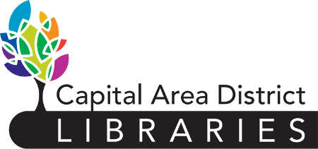

# Three places kids can learn to code in Lansing

Exposing your kid to programming at an early age can offer them huge benefits both now and in their future, even if they aren't interested in becoming an engineer when they grow up.

Learning to code &mdash; even just a little bit &mdash; can help develop a child's problem-solving skills and help prepare them for a day when computers are even more pervasive than they are today. Not to mention using video games and robots to learn how to code is a lot of fun!

Lansing has a pretty well-connected [tech community](https://www.lansing.codes/), but did you know there are also lots of places you can take your kid to get them involved in coding?

Here are three of my faves.

## tinkrLAB

If science were candy, this would be the shop to take your kid to satisfy their sweet tooth. Located in the Meridian Mall, [tinkrLAB](https://www.tinkrlab.com/) offers tons of ways to get your kids' hands on technology. Even grown-ups may find it hard to walk out without a new project or hobby.

During the school year, tinkrLAB offers a variety of classes to expose your kid to programming. Whether it's coding in Minecraft or working with robots and circuitry, kids of all ages can find some way to learn about coding.

tinkrLAB hosts summer camps at a variety of locations around the Greater Lansing area, too. The age range depends on the nature of the camp, but the topics are explored at a much deeper level than the classes.

## Impression 5 Science Center

[Impression 5](https://impression5.org/) is just an amazing place to take kids in general, and more specifically, they have a great selection of camps for young ones who want to learn to code.

Their Summer L.A.B.S. is a series of week-long camps and several of them help introduce young kids to code and help older kids dig in a little deeper. Here's a glimpse at some of the camps:

* **Girls-only Coding Camp** introduces app, website, and robotics development.
* **Techno City** explores designing circuits that light up a small city.
* **Video Game Science** has kids design, make, and demo a video game.
* **App Designer** shows kids how to make a phone or tablet app.

There are also many other day- and week-long camps that help develop problem-solving and critical thinking skills.

## Your local library

The library is a traditional way for kids to get some extracurricular education. Lansing's libraries continue to remain relevant in that regard as technology becomes more and more prominent in our lives, and I don't mean they simply added a selection of learn-to-code books!

The [Capital Area District Library in Haslett](https://www.cadl.org/events/browse-all-events/?branch=haslett) has two ways your kids can get hands-on exposure to code. The first is a monthly [CoderDojo](https://zen.coderdojo.com/dojo/us/haslett-mi/haslett-mi-cadl-haslett-library-1) hosted on the first Saturday of the month during the shool year. Kids learn to use Scratch, Sphero and Ollie robots, and other ways to make something with code and show it off. They also have a weekly Summer STEAM series that explores even more engineering topics.

The [Delta Township Library](http://dtdl.evanced.info/signup) has their own Coding Camp that runs over the summer, too. Your kids will learn Ruby and use it to program in a lot of different ways, including robotics.

You should also check your local library, too. You may be surprised to see how many hands-on activities they offer for your kids!
